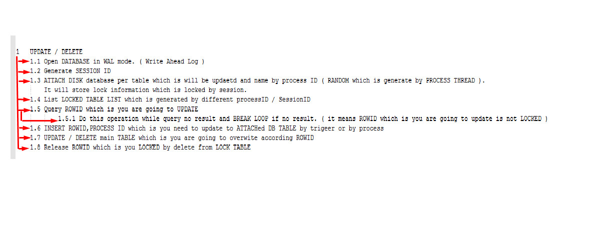

## Thực hiện đa luồng ghi (hoạt động ghi) trên SQlite vào gần như cùng một lúc / Almost row level lock performance.
Gửi các bạn,    
Như các bạn đã biết, Cơ sở dữ liệu đơn luồng SQLite được mắc đinh đưa vào hệ điều hành Linux. Đã có rất nhiều nghiên cứu về SQlite để lưu trữ dữ liệu. Nghiên cứu về cách truy cập SQlite với hành động ghi đa luồng. Tôi sẽ chia sẻ một nghiên cứu nhỏ của tôi về cách để thực hiện được việc ghi đa luông trong CSDL SQlite.  
- Hãy tìm hiểu về ưu và khuyết điểm của SQlite

#### Ưu điểm:
- SQlite được viết trên ngôn ngữ C, vì thế nó có thể truy cập ổ cúng, bộ nhớ và xử lí dữ liệu rất nhanh. Hãy thử nghĩ nếu bạn đang dùng SSD. :v
- SQlite hỗ trợ bộ nhớ trong, bộ nhớ trong với SQlite gần như nhanh gấp 2 lần. Nếu bạn hiểu về việc phân trang, nó là đủ nhanh.
- SQlite là CSDL đơn luồng nên rủi ro về sai lạc dữ liệu là rất thấp.
- SQlite lưu dữ liệu trên  một file duy nhất nên chúng ta có thể di chuyển và truy cập trên nên tảng khác một cách rất dễ dàng.
- SQLite is 0 administration for end user. 
- Đa nền tảng! SQLite có thể được dùng trên nhiều nền tảng khác nhau.
- MÃ NGUỒN CÓ NÓ MỞ !!!
- Vân vân...

#### Vài nhược điểm
- Như ta đã kể ra, SQLite hoạt động đơn luồng, điều đó có nghĩa SQlite thực hiện chỉ 1 hoạt động ghi trong cùng một thời điểm.
- SQlite lưu dữ liệu trong một file, như thể nghĩa là toàn bộ dữ kiệu sẽ bị khóa trong quá trình ghi. Diều này là rất tệ đối với một CSDL đồ sộ và có mức độ truy cập mạnh mẽ.
- Không phân quyền truy cập ứng dụng 

### Thực hiện việc ghi đa luồng trong gần như cùng một thời điểm
Bây giờ tôi sẽ chỉ ra mẹo nhỏ để tiến hành ghi vào cùng một thời điểm.  
**SQlite không bao giờ cho phép bạn đạt được ROW LEVEL LOCK nên đừng phí thời gian tìm kiếm về nó.**
Tất nhiên nó có thể ảnh hwuowngr đến hiệu năng nếu bạn tiến hành ghi trên một phần lớn của bảng. Nhưng luồng thứ hai sẽ không tốn thời gian như luồn đầu tiên.

- đây là điểm mấu chốt:  
Như bạn biết B TREE index là rất nhanh và hnahf động ghi của ban sẽ được thực hiện theo ID từng dòng vốn được index mặc định  
VD:
**delete from table where name='Fariz'** // Nó sẽ khóa toàn bộ dữ liệu chính trong 10 s  
**THAY THẾ BẰNG**  
**insert into tepm.Lock select rowid,'processid' from table where name = 'Fariz';** // Nó sẽ chỉ khóa dữ liệu tạm thời trong 10s  
**delete from table where ROWID in ( select rowid from tepm.Lock where name='fariz' and processid='XYZ' )** // việc xóa sẽ khóa DB file chỉ trong 0.001 s  
- tôi đã làm một bài test nhỏ và kết quả rất tốt đối với tôi. Tôi đã thực hiện 2 cập nhật trong 11s. Mõi tiến trành mất 10s cho bảng với khoảng 40 triệu dòng  
**Hi vọng những gì tôi vừa trình bày sẽ giúp ích cho những ai dungf SQLite**
